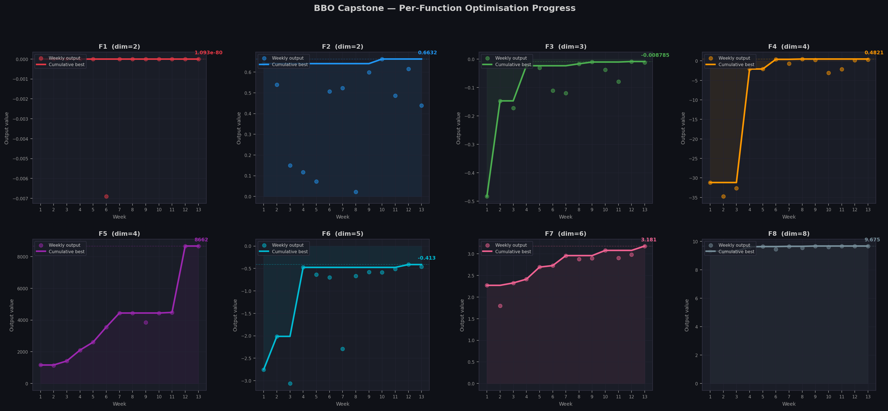
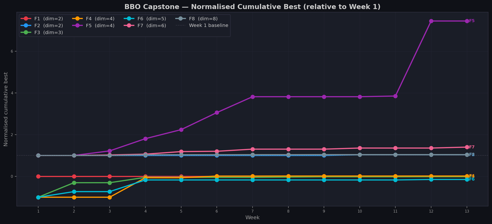

# Black-Box Optimisation (BBO) Capstone Project

## Project Overview

This project addresses a constrained black-box optimisation problem in which objective functions are unknown and can only be evaluated through limited, expensive queries.

The goal is to maximise each function efficiently while minimising evaluations.  
The setup mirrors real-world ML deployment scenarios:

- Expensive evaluations
- Unknown functional structure
- Sparse and noisy observations
- Limited query budgets

Weekly progress is documented in:

- [Week 01](capstone/reports/week_01.md)
- [Week 02](capstone/reports/week_02.md)
- [Week 03](capstone/reports/week_03.md)
- [Week 04](capstone/reports/week_04.md)
- [Week 05](capstone/reports/week_05.md)
- [Week 06](capstone/reports/week_06.md)
- [Week 07](capstone/reports/week_07.md)
- [Week 08](capstone/reports/week_08.md)
- [Week 09](capstone/reports/week_09.md)
- [Week 10](capstone/reports/week_10.md)
- [Week 11](capstone/reports/week_11.md)
- [Week 12](capstone/reports/week_12.md)
- [Week 13](capstone/reports/week_13.md)

---

- [Dataset Datasheet](capstone/docs/datasheet.md)
- [Model Card](capstone/docs/model_card.md)

---

## Results

### Per-Function Progress

### Normalised Cumulative Best (All Functions)

---

## Problem Setting

Each function receives an input vector:

x1 – x2 – ... – xn

Where:
- xi ∈ [0, 1)
- Six decimal precision
- Dimensionality ranges from 2D to 8D

The output is a scalar value to be maximised.

Constraints include:

- Unknown function form
- Strongly varying output magnitudes
- Severe sparsity in higher dimensions
- One query per function per week (12 weeks total)

---

## Theoretical Foundations

The optimisation framework is based on **Bayesian Optimisation** using a Gaussian Process (GP) surrogate model.

Key references informing this design:

- Rasmussen & Williams (2006) — *Gaussian Processes for Machine Learning*
- Jones et al. (1998) — *Efficient Global Optimization (EGO)*
- Srinivas et al. (2010) — *Gaussian Process Upper Confidence Bound (GP-UCB)*

Bayesian optimisation is particularly suitable for:

- Expensive black-box functions
- Low to moderate data regimes
- Problems requiring uncertainty-aware decisions

The surrogate model approximates the unknown function, while acquisition functions guide exploration vs exploitation.

---

## Surrogate Model

A Gaussian Process with an RBF (squared exponential) kernel is used.

Key implementation features:

- Cholesky decomposition for numerical stability
- Target normalisation (z-score) prior to GP fitting
- Function-specific kernel length scales
- Selective noise regularisation
- Explicit variance clipping for stability

The GP was implemented manually (NumPy-based) rather than using scikit-learn to:

- Retain full control over acquisition behaviour
- Modify hyperparameters per function
- Improve interpretability of surrogate dynamics

---

## Acquisition Strategies

Multiple acquisition functions are implemented:

- Expected Improvement (EI)
- Upper Confidence Bound (UCB)
- Variance sampling
- Spread-based maximin sampling (Week 6 addition)

Each function uses a tailored acquisition configuration.

Exploration–exploitation balance is adjusted per landscape:

- EI for aggressive local refinement
- UCB for uncertainty-aware recovery
- Variance for exploration-dominant cases
- Spread sampling for flat/degenerate surfaces (Function 1)

---

## Evolution of Strategy

### Week 1–2
Baseline GP with mixed acquisition functions.
Exploration-heavy to understand global structure.

### Week 3
Hybrid strategy. Function-specific adjustments introduced.

### Week 4
Stabilisation phase.

- Target normalisation activated
- Function-specific kernel tuning
- Controlled UCB recovery for unstable functions
- Increased local sampling density

### Week 5
Refinement and code quality improvements.

- Fixed surrogate miscalibration in Function 2
- Restricted sampling to dominant centre
- Cleaned numerical redundancies
- Improved GP inference stability

Function 5 and Function 7 showed consistent improvement.

### Week 6
Strategic divergence by function:

- Preserved aggressive exploitation for F5 and F7 using Expected Improvement
- Reintroduced uncertainty-guided recovery for F2 using UCB with moderate kappa
- Introduced spread-based sampling for F1 after repeated near-zero outputs
- Applied uncertainty-driven exploration for F4 which resulted in a major improvement

### Week 7
Recovery and exploitation consolidation.

- Replaced spread-based sampling for F1 with EI-driven local search
- Maintained single-centre constraint for F2 with tight local sampling
- Reduced UCB kappa for F4 to consolidate positive region found in Week 6
- Reset F6 to variance-driven exploration after UCB failed to hold gains
- Reduced UCB kappa for F8 to limit over-exploration
- F5 continues strong upward trend with GP predicting above 3900

### Week 8
Targeted hyperparameter tuning and controlled recovery.

- Replaced pure variance exploration for F1 with UCB to balance uncertainty and predicted value
- Relaxed the overly tight local search for F2 by reducing local fraction and increasing exploration pressure
- Expanded local sampling range for F3 to avoid premature convergence around weak signals
- Reduced UCB exploration pressure for F4 to refine the positive region discovered in Week 6
- Continued aggressive EI-based boundary refinement for F5 after strong peak expansion
- Switched F6 from variance exploration to UCB recovery to avoid random low-value regions
- Maintained EI-driven local refinement for F7 after steady improvements
- Slightly reduced local sampling pressure for F8 to prevent over-concentration in high dimensions

### Week 9
Full exploitation phase — 4 weeks remaining.

- Increased candidate count to 150k for finer search resolution
- Switched F3 and F4 to tighter local sampling around confirmed best regions
- F4 moved from EI to UCB with low kappa to manage high surrogate uncertainty
- F7 and F8 fully switched to EI for stable local refinement
- F2 kappa reduced further to prevent excursions from high-value region
- F5 continues exploitation near upper search boundary

### Week 10
Final exploitation phase — 3 weeks remaining.

- Switched F1 from spread to EI, targeting the only observed non-zero region
- Switched F2 from UCB to EI with localStd=0.006 for precise boundary targeting
- Introduced F5-specific candidate generation — x1 free, x2/x3/x4 pinned to 0.999999 boundary
- Tightened localStd for F3, F7 and F8 to narrow exploitation around confirmed peaks
- Switched F4 from UCB to EI with topK=1 constraint

### Week 11
Maximum exploitation — 2 weeks remaining.

- Tightened localStd further for F2 (0.005), F3 (0.010), F7 (0.015) and F8 (0.018)
- Applied topK=1 constraint to F1, F2, F3, F4 and F8
- F1 EI targeting the only observed non-zero region
- F4 and F6 continued with tight local refinement despite high surrogate uncertainty
- F5 boundary-pinned candidate generation maintained

### Week 12
Final round — maximum exploitation with structural improvements.

- Increased candidate count to 200k for finest search resolution
- Added per-function GP model parameters via getModelParams() — separate lengthScale and noiseLevel per function
- Added filterTopK() to fit GP on recent high-value observations only, reducing noise from early exploratory queries
- F5 fixed to 0.999999-0.999999-0.999999-0.999999 based on boundary ridge evidence
- F2 and F3 single-centre EI with very tight localStd (0.005, 0.004)
- F8 switched to UCB with kappa=0.0 and wider localStd after EI failed to calibrate in 8D
- buildCandidatesF1 introduced — dual-centre sampling around best and most informative observed point

### Week 13
Final submission — last iteration, full exploitation lock-in.

- Maintained high candidate count (200k) for maximum resolution in final search
- Applied strict EI-based local exploitation across all stable functions (F2, F3, F4, F7)
- Further reduced localStd for F2, F3 and F7 to ensure ultra-tight refinement around confirmed peaks
- Introduced F1-specific dual-centre + mirror sampling to attempt final recovery of flat landscape
- Stabilised F4 by reverting from high-uncertainty regions back to previously successful cluster
- Maintained UCB with moderate kappa for F6 as the only remaining recoverable function
- Preserved F8 near-peak region with low-exploration UCB configuration
- Locked F5 to boundary optimum (all dimensions = 0.999999), based on consistent ridge behaviour across multiple weeks

### Final
Campaign conclusion — final round with targeted refinements.

- Reduced filterTopK limits for F2 and F6 to 10 observations for tighter local GP calibration
- Added filterTopK(10) for F7 — excluded early exploratory queries that were misleading the surrogate
- F4 switched from UCB to EI with single-centre constraint around the Week 8 peak
- buildCandidatesF1 extended with a mirror centre at (0.580, 0.536) as a speculative final attempt
- F5 continued fixed boundary submission, locking in the Week 12 record
- F7 achieved a new campaign best of 3.181, confirming the value of late-stage filterTopK adjustments

The final iteration prioritised reliability over exploration, ensuring all queries remained within validated high-performing regions while allowing minimal controlled recovery where justified.

**Final campaign results:**

| Function | Dim | Week 1 Best | Final Best | Change |
|----------|-----|-------------|------------|--------|
| F1 | 2 | ~0 | ~0 | No improvement |
| F2 | 2 | 0.641 | 0.663 | +3.4% |
| F3 | 3 | -0.483 | -0.009 | Major improvement |
| F4 | 4 | -31.18 | +0.482 | Major improvement |
| F5 | 4 | 1163.7 | 8662.4 | +644% |
| F6 | 5 | -2.75 | -0.413 | Major improvement |
| F7 | 6 | 2.27 | 3.181 | +40.1% |
| F8 | 8 | 9.31 | 9.675 | +3.9% |

Seven out of eight functions showed meaningful improvement over the 13-week
campaign. The strongest result was Function 5 with a 644% gain from the Week 1
baseline, confirming the value of the boundary exploitation strategy. Function 1
remained the single unresolved case — 13 rounds of varied acquisition strategies
produced no identifiable high-value region.

---

## Design Trade-offs

This project explicitly balances:

- Exploration vs exploitation
- Surrogate confidence vs model overconfidence
- Stability vs aggressive peak-seeking
- Global coverage vs trust-region refinement

High-dimensional functions (6D–8D) required tighter local refinement and controlled uncertainty handling.

---

## Future Extensions

Potential next steps include:

- Neural network surrogate models
- Trust-region Bayesian Optimisation (TuRBO)
- Random embeddings for high-dimensional BO
- Automatic hyperparameter optimisation of the surrogate
- Comparative benchmarking against scikit-learn GP

---

## Reflection

This project demonstrates structured decision-making under uncertainty rather
than brute-force search. The code remained intentionally simple; the strategy
evolved through evidence-driven iteration.

The optimisation process transitioned from generic Bayesian optimisation to
adaptive, function-aware, uncertainty-calibrated search. Performance gains in
F5 (+644%) and F7 (+40%) validate the exploit-refine strategy, while the
persistent difficulty of F1 and F4 illustrates the limits of surrogate-based
optimisation under extreme query constraints.

The campaign showed that no single acquisition rule works across all functions.
Each landscape required its own configuration, informed by accumulated
observations rather than applied uniformly. Late-campaign strategic adjustments
— including the Week 12 fixed submission for F5 and the Week 13 filterTopK
expansion for F7 — delivered meaningful improvements even in the final rounds,
demonstrating that careful analysis remains valuable throughout the campaign.

The full project implementation, weekly reports, datasheet, model card, and all
submission data are available on GitHub:

https://github.com/absoyak/imperial-ml-ai-capstone
